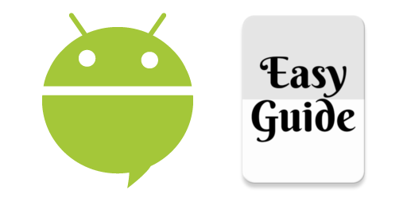

# Easy Guide
Platform that aims to provide accessibility for the visually impaired through the use of the web, beacons and mobile applications. It's divided by 2 environments for now: Android and Firebase (with Serverless Web Application and Realtime Database).


### Android
The Android application works as final user interface, giving them information about nearest objects and locations.



The app scans near beacons and get it informations in a firebase database. If accessibility mode is ON then Easy Guide shows the content by voice.

### Web Application
Admins interface to manage users and beacons contents.
It's possible to change user profile and setup beacons content and actions according to that.

### Get Started

#### Firebase
 - Download or clone [master](https://github.com/pedroartsimao/easyguide/tree/master) branch;
 - Create a new project on [Firebase Console](https://console.firebase.google.com/);
 - Enable Login with Google Account in Authentication menu (see more details [here](https://firebase.google.com/docs/auth/))
 - Import initial database structure in Database menu (see more detail [here](https://firebase.google.com/docs/database/));

#### Web
- TODO

#### Android
 - Register the Android App in Project Settings menu on [Firebase Console](https://console.firebase.google.com/), download `google-services.json` file and put it on `android/app` folder (see more details [here](https://firebase.google.com/docs/android/setup));
 - Create a new Project on [Estimote Cloud](https://cloud.estimote.com/#/apps) and create `estimote-credencial.properties` file in `android/app/` folder based in `estimote-credencial.properties.sample` (found in the same folder);
 - Open `android` folder in **Android Studio**;
 - Build it!

### Contributing
See our [Contributing Guide](https://github.com/pedroartsimao/easyguide/wiki/1.-Guide:-Contributing) page on Easy Guide Wiki for checking tips of enviorenment setup and good pratices to follow.

### License
```
Copyright (C) 2016 Pedro Simão

Licensed under the Apache License, Version 2.0 (the "License");
you may not use this file except in compliance with the License.
You may obtain a copy of the License at

   http://www.apache.org/licenses/LICENSE-2.0

Unless required by applicable law or agreed to in writing, software
distributed under the License is distributed on an "AS IS" BASIS,
WITHOUT WARRANTIES OR CONDITIONS OF ANY KIND, either express or implied.
See the License for the specific language governing permissions and
limitations under the License.
```

### Contact
Want to get in touch, ask a question, or talk to me about anything else which isn't on the [Easy Guide Wiki](https://github.com/pedroartsimao/easyguide/wiki)? Ping Easy Guide team on <easyguideteam@gmail.com>.

Thanks for your interest, Pedro Simão
